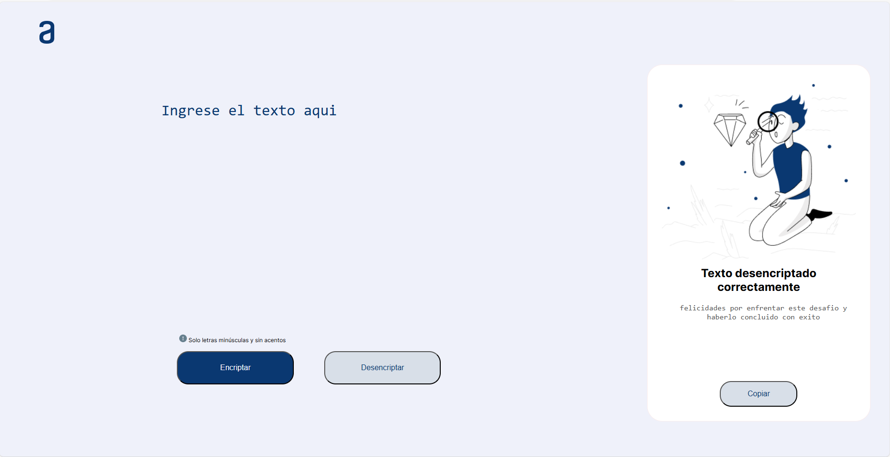

# Sobre el challenge # 1
Este challenge fue el proyecto final de la ruta de estudio de principiante en programacion del [programa one](https://www.oracle.com/co/education/oracle-next-education/).

En el cual los maestros de la plataforma de [Alura latam](https://www.aluracursos.com/) nos propusieron realizar un encriptador de texto que tenga las siguientes caracteristicas:

---

## Caracteristicas

1. **(obligatorio)** Debe permitir encriptar y desencriptar los mensajes proporcionados siguiendo las siguiente llave de encriptacion:

    * La letra "e" es convertida para "enter"
    * La letra "i" es convertida para "imes"
    * La letra "a" es convertida para "ai"
    * La letra "o" es convertida para "ober"
    * La letra "u" es convertida para "ufat"

1. **(obligatorio)** No debe permitir letras en mayusculas ni acentos ni caracteres especiales.

1. **(extra)** Boton de copiar resultado encriptado o desencriptado.

## Capturas

Muestra del favicon de la pagina

---

Muestra de la version de escritorio de la pagina

Muestra de la version de tablet de la pagina

---

---

Muestra de la version de mobil de la pagina

---

Muestra de la pagina sin ingresar textos desde la vista desktop

---
